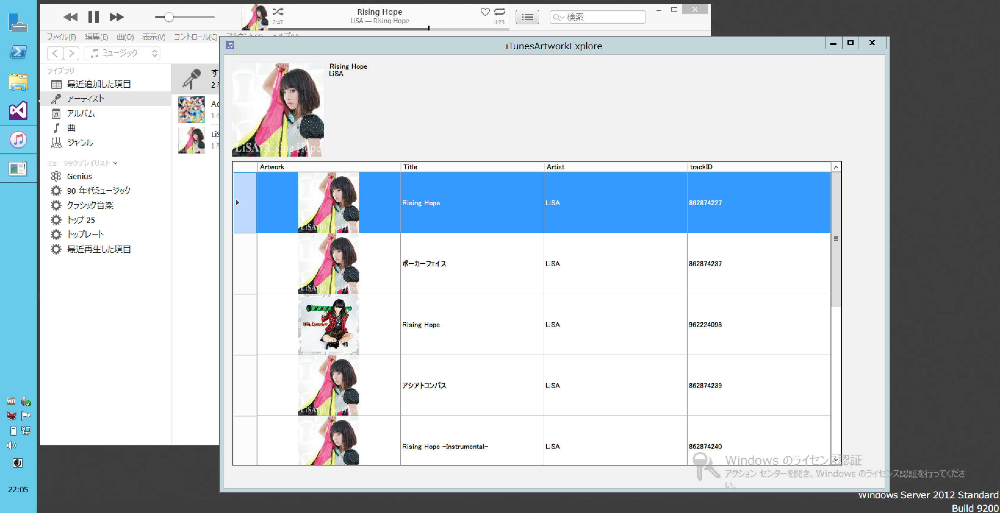

#iTunesArtworkExplorer
iTunesArtworkExplorer gives you High Resolution Artwork images.

##Installation
Click [here](https://github.com/kateinoigakukun/iTunesArtworkExplore/iTunesArtworkExplore/bin/Release/app.publish/iTunesArtworkExplore.exe) to download EXE file. And you have only to double click `iTunesArtworkExplorer.exe`

##Usage
When a song is playing on iTunes, iTunesArtworkExplorer automatically shows artwork list. Please select correct artwork.

##Demo

